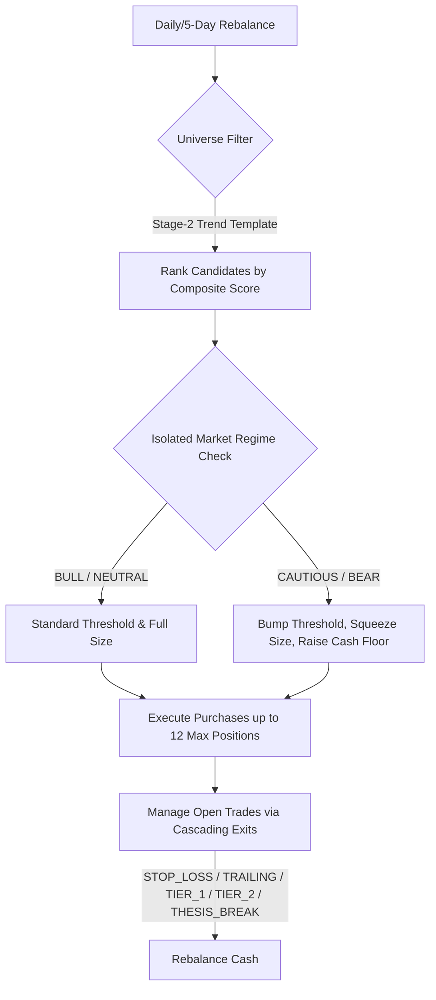

# Technical Strategy Blueprint: Multi-Market Stage-2 Momentum SIP

This document serves as the definitive technical reference manual for your systematic trading engine. It outlines the complete quantitative rules, entries, exits, risk management, and portfolio construction logic verified in the 7-year broad-market stress-test simulation.



---

## 🌐 1. Universe Selection & Warmup Data

* **Data Sourcing:** Point-in-time daily historical market data covering broad large- and mid-caps across two primary jurisdictions:
  * **India (IN):** Nifty 500 index constituents.
  * **United States (US):** S&P 500 index constituents (with an automatic Wikipedia S&P MidCap 400 constituent fallback if direct iShares APIs are blocked by security filters).
* **Warmup Phase:** The engine programmatically downloads and parses **365 days of historical warmup data** preceding the start date. This is critical to ensure all lagging indicators—such as the 200-day Simple Moving Average (SMA) and Average True Range (ATR)—are mathematically fully-formed before the first simulated trading day.

---

## 📈 2. Technical Entry Setup (The Stage-2 Scorer)

Entry candidate identification is built on the core principles of Mark Minervini's **Stage-2 Trend Template**, identifying high-momentum leaders in active primary uptrends:

### A. Hard Technical Filter (Uptrend Template)
To qualify for entry scoring, a stock must satisfy all of the following structural trend rules:
1. **Simple Moving Averages:** Daily close price must be strictly above both the **50-day SMA** and the **200-day SMA**.
2. **SMA Alignment:** The **50-day SMA** must be strictly above the **200-day SMA**.
3. **Uptrending 200 SMA:** The **200-day SMA** itself must be in a verified uptrend (its slope must be positive, rising for at least 20 trading days).
4. **Extension Limit:** The stock must not be parabolically extended (e.g. price must not be more than 25% above its 200-day SMA, preventing "top-chasing").
5. **RSI Strength:** The 14-day **Relative Strength Index (RSI)** must be in a healthy, active momentum range (above 50, but below heavily overbought territory).

### B. Composite Ranking Engine
Every stock passing the template is assigned a **Composite Score (0 to 100)**:
* **Base Technical Score:** Formed by combining raw medium-term price momentum, relative strength, and volume expansion.
* **Relative Strength (RS) Decile Bump (+10.0):** Stocks ranking in the top deciles of performance compared to the broader universe are granted a cross-sectional boost.
* **Sector Strength Bump (+5.0):** Candidates belonging to leading, high-momentum industry sectors are prioritized.
* **Capacity Sizing:** The portfolio ranks all qualifying candidates daily and only fills open slots (up to **12 maximum concurrent positions**) with the absolute "cream of the crop" (highest ranked scores).

---

## 🛡️ 3. Isolated Market Regime Sizing & Cash Floors

Your primary risk-management engine operates per-country, ensuring the portfolio is highly responsive to local market environments:

```
                  [ Multi-Market Regime Detector ]
                             |
         +-------------------+-------------------+
         |                                       |
    [ US Regime ]                           [ IN Regime ]
  e.g. BEAR (Halt Buys)                   e.g. BULL (Active entries)
```

### A. Isolated Regime Sizing
* **Local Regime Bumps:** The minimum score required to enter a trade is dynamically adjusted per market based on its specific regime detector:
  * **BULL / NEUTRAL_BULL:** Base threshold (e.g. **60.0**).
  * **CAUTIOUS:** Base threshold **+7.0** (demands higher conviction setups).
  * **BEAR:** Base threshold **+15.0** (locks out average setups; only elite institutional breakouts pass).
* **Local Allocation Multipliers:** Per-trade sizing is multiplied by the market's specific allocation factor (e.g. full size in BULL, **x0.50** size in CAUTIOUS/BEAR).

### B. Cash Floors & Regime De-risking
* **Average Cash Floor:** Enforces a cash reserve ratio across the active book based on the average cash floor of the active markets (e.g. 30% cash in CAUTIOUS, 60% cash in BEAR).
* **Active Regime Trimming:** The very day a country's regime transitions into CAUTIOUS or BEAR, the engine immediately triggers a **50% partial liquidation (`REGIME_DERISK`)** on all active open positions in that market, locking in profits and expanding the portfolio's cash cushion.

---

## 💎 4. Cascading Exits (The "Smart Stop" Logic)

Once a position is entered, its lifecycle is managed dynamically by five overlaying exit layers to cut losses short and let winners run:

```
                       [ Open Position ]
                               |
         +---------------------+---------------------+
         |                                           |
  [ Negative Exits ]                         [ Positive Exits ]
  - Initial ATR Stop-Loss                    - Tier 1 Scale-out (+22% target: Sell 33%)
  - Thesis Break (SMA 50 violation)          - Tier 2 Scale-out (+40% target: Sell 33%)
  - Time Stop (extended sideways)            - Trailing ATR Stop (activated post-Tier 1)
```

1. **Initial Stop-Loss (`STOP_LOSS`):**
   * Placed immediately at entry at **`3.0 * ATR` below the entry price** (maximum capital protection floor).
   * Tightened in weaker regimes (e.g., stop size multiplied by **0.65** in CAUTIOUS and **0.50** in BEAR) to limit loss exposure.
   * **Intraday Gap Protection:** Restores the wider ATR stop floor during the first few days of the trade, preventing overnight market gap-downs from triggering premature exits.
2. **Partial Profit Taking Tiers:**
   * **Tier 1 Target (+22% gain):** The engine programmatically sells **33.3% of the initial quantity** to secure capital and guarantee a profitable trade.
   * **Tier 2 Target (+40% gain):** Sells another **33.3%** of the position (locking in substantial market gains).
3. **Trailing Stop-Loss (`TRAILING`):**
   * Activates programmatically the moment a position hits its **Tier 1 target**. 
   * Tracks the highest high reached by the stock since entry and trails at **`3.0 * ATR`** below the peak. If the stock continues to climb, the trailing floor climbs with it, securing maximum windfall gains.
4. **Thesis Break / Technical Violation (`THESIS_BREAK`):**
   * If a stock closes below its **50-day SMA** or violates the Stage-2 structural trend template, the position is immediately closed at the market close, bypassing standard stops.
5. **Time Stop (`TIME_STOP`):**
   * If a trade sideways-chops and remains stagnant without hitting trailing stops or profit targets for an extended period, it is systematically closed to reallocate capital into higher-velocity breakouts.

---

## 💰 5. Portfolio Construction & Rebalancing

* **Execution Frequency:** The portfolio executes simulated rebalancing and orders every **5 trading days**, matching standard systematic rebalancing frequencies.
* **Monthly SIP Cash Inflow:** Generates a systematic cash injection of **₹50,000 on the 13th day of every month**, capturing the dollar-cost-averaging effect during bear markets.
* **Realistic Friction:** Every buy and sell order is executed with a strict **25 bps round-trip transactional penalty** (15 bps brokerage/exchange costs + 10 bps execution slippage) to ensure the results translate directly to real-world brokerage accounts.
